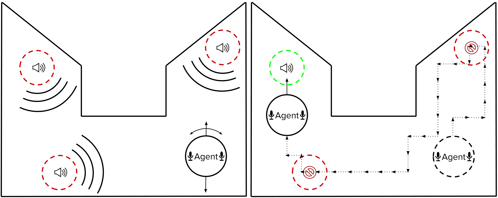

<h1 align="center">OtoWorld</h1>

Otoworld is an interactive environment for training agents for the task of audio separation. <br>





[**Paper Submission**](https://openreview.net/forum?id=lzZGXUpV78X)

## Installation 
* Clone the repository
```
git clone https://github.com/pseeth/otoworld.git
```
* Create a conda environment: 
```
conda env create -n otoworld
``` 
* Activate the environment:
```
conda activate otoworld
```
* Install requirements (which includes [nussl](https://github.com/nussl/nussl))
```
pip install -r requirements.txt
```
* Install ffmpeg from conda distribution (Note: Pypi distribution of ffmpeg is outdated)
```
conda install ffmpeg
```
* Install Pytorch **1.3** or **1.4** from official source 
```
pip install torch==1.3.0+cu100 torchvision==0.4.1+cu100 -f https://download.pytorch.org/whl/torch_stable.html
```

## Additional Intallation Notes - Linux
* Linux users may need to install the sound file library if it is not present in the system. It can be done using the following command: 
```
sudo apt-get install libsndfile1
```

This should take care of a common `musdb` error.

## Demo and Tutorial 
You can get familiar with this OtoWorld using our tutorial notebook: [Tutorial Notebook](https://github.com/pseeth/otoworld/blob/master/notebooks/tutorial.ipynb)

To run for yourself, run `jupyter notebook` and navigate to the notebook in the `notebooks/` folder.

### Experiments
You can also view (and run) examples of experiments we ran in `experiments/`. 


